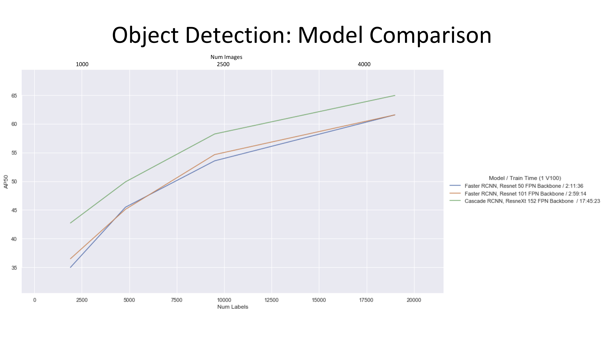
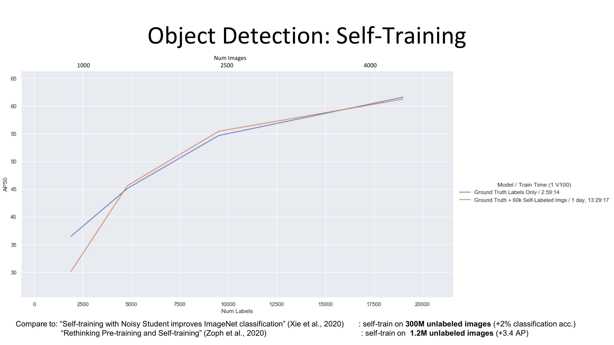
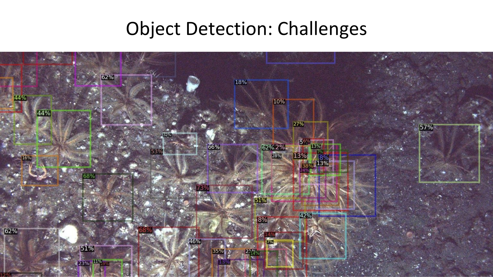

# NOAA GPU Hackathon 2020, AiFish+Lynker

This repository contains the object detection code for Ai.Fish + Lynker's NOAA GPU Hackathon 2020 entry. The Hackthon took place December 7-9 2020.

Our aim was to analyze a large quantity (~1.4tb) of unannotated bottomfish imagery collected by ROV from the US west coast. To this end our main objectives were:

- collect as many expert annotations as possible the course of three days
- compare the performance of several SOTA object detection models on subsets of this labeled data, to get an idea of how these models perform in very low-data regimes
- investigate the use of self-training for object detection on the large unlabelled dataset
- build an active learning system for classification of bounding box outputs from the object detector

## Results

We collected ~15,000 expert-level annotations, as well as around ~5000 additional weaker annotations (these labels came from 1. our team of non-biologists manually annotating and 2. generating approximate bounding boxes from an existing set of keypoint annotations).

All object detection models we compared are based on the R-CNN architecture:

- Faster R-CNN w/ Resnet-50 + FPN backbone
- Faster R-CNN w/ Resnet-101 + FPN backbone
- Cascade R-CNN w/ ResneXt-152 + FPN backbone

Each of these models were trained with 10%, 25%, 50%, and 100% of the labelled data, and evaluated on a held-out validation set of ~3000 annotations. We see consistently that more labelled data offers larger performance gains than increasing model complexity; though, even when only 10% of labels are utilized, the much larger model still outperforms the others by a wide margin (at the cost of ~6x training time).



We then performed an investigation into self-training, using the Faster R-CNN w/ Resnet-101 models to label ~60k additional images and re-training using those labels. With our settings, we do not see a performance gain from self-training; and, for the very-low-data model (initially trained with 10% of our labels), we see a significant drop in performance after self-training. This seems to imply that 1. a very large amount of data is required for effective self-training, and 2. self-training may reinforce bad existing biases.



## Example Outputs





## Setup
```
conda create -n noaa python=3.7
conda activate noaa
pip install -r requirements.txt \ 
  -f https://dl.fbaipublicfiles.com/detectron2/wheels/cu101/torch1.6/index.html \
  -f https://download.pytorch.org/whl/torch_stable.html
pip install -e .
```

To add the conda env as a Jupyter kernel:
```
conda activate noaa
python -m ipykernel install --user --name noaa
```

Install submodules:
```
git submodule update --init
cd lib/detectron2_backbone
python setup.py build develop
```

Notes: 
- assumes CUDA 10.1, and will install pytorch 1.6

## References

[Self-training with Noisy Student improves ImageNet classification](https://arxiv.org/abs/1911.04252) Qizhe Xie, Minh-Thang Luong, Eduard Hovy, Quoc V. Le

[Rethinking Pre-training and Self-training](https://arxiv.org/abs/2006.06882) Barret Zoph, Golnaz Ghiasi, Tsung-Yi Lin, Yin Cui, Hanxiao Liu, Ekin D. Cubuk, Quoc V. Le

[Faster R-CNN: Towards Real-Time Object Detection with Region Proposal Networks](https://arxiv.org/abs/1506.01497) Shaoqing Ren, Kaiming He, Ross Girshick, Jian Sun

[Cascade R-CNN: Delving into High Quality Object Detection](https://arxiv.org/abs/1712.00726) Zhaowei Cai, Nuno Vasconcelos

[Deep Residual Learning for Image Recognition](https://arxiv.org/abs/1512.03385) Kaiming He, Xiangyu Zhang, Shaoqing Ren, Jian Sun

[Aggregated Residual Transformations for Deep Neural Networks](https://arxiv.org/abs/1611.05431) Saining Xie, Ross Girshick, Piotr Dollár, Zhuowen Tu, Kaiming He

[Feature Pyramid Networks for Object Detection](https://arxiv.org/abs/1612.03144) Tsung-Yi Lin, Piotr Dollár, Ross Girshick, Kaiming He, Bharath Hariharan, Serge Belongie

[Detectron2](https://github.com/facebookresearch/detectron2) Yuxin Wu and Alexander Kirillov and Francisco Massa and Wan-Yen Lo and Ross Girshick
